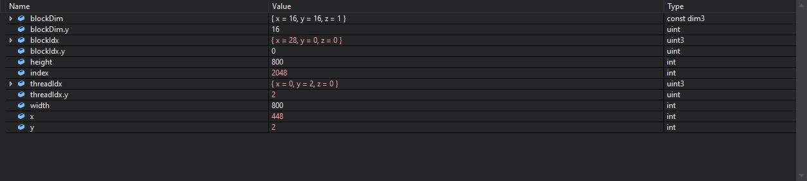

Project 0 Getting Started
====================

**University of Pennsylvania, CIS 565: GPU Programming and Architecture, Project 0**

* Tianming Xu (Mark)
  * www.linkedin.com/in/tianming-xu-8bb81816a (LinkedIn)
* Tested on: Windows 10, i7-8700 @ 3.20GHz 16GB, GTX 2080 8192MB (my personal desktop)

### Readme for project 0

Screenshot for CUDA modification:

Screenshot for WebGL compatibility:

screenshot for Performance analysis report

Screenshot for CUDA debugger

Auto page:

Warp Info:

For the last screenshot, I can't get access to CUDA info->Warp because my Graphics card is RTX 2080 which is not supported by legacy CUDA debugger. Hence, instead, I took a screenshot on the next gen debugger's Warp info page.

